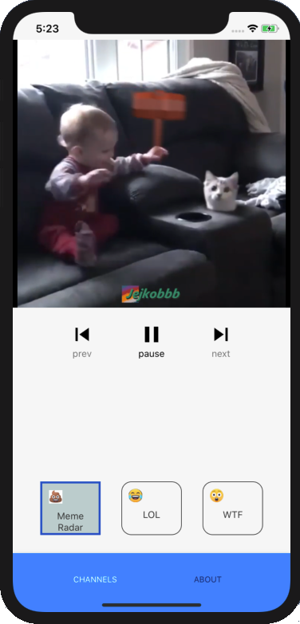

# Mobile Developer Assignment

I have done this assignment for NeverThink with using React Native.

## Preview



## Running the project


```sh
$ git clone https://github.com/MostafaIn/Mobile_Developer_Assignment.git
$ cd Mobile_Developer_Assignment
$ npm install OR yarn install
```

For iOS, also install the Cocoapods

```sh
$ cd ios
$ pod install
$ cd ..
```

Then build and run with `npx react-native run-ios`.


## Done By
- Mostafa Hazareh (mostafa2015se@gmail.com)